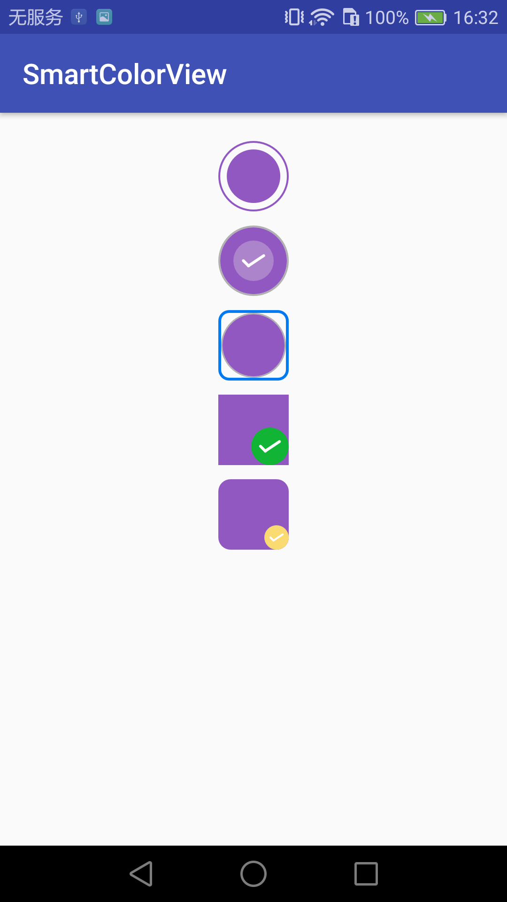
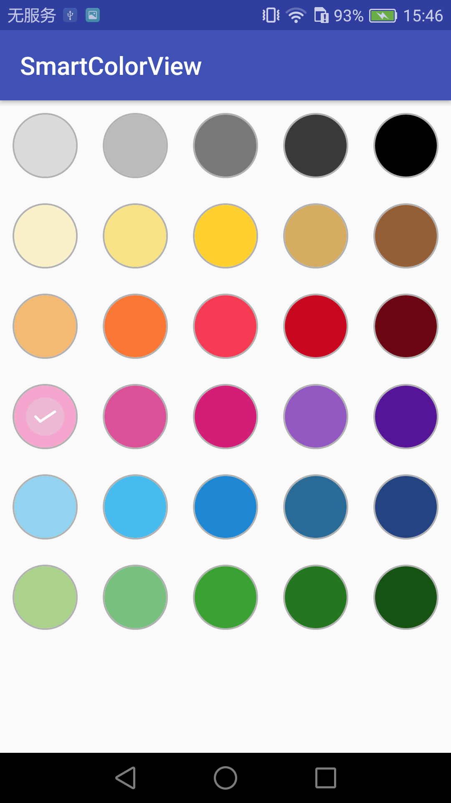
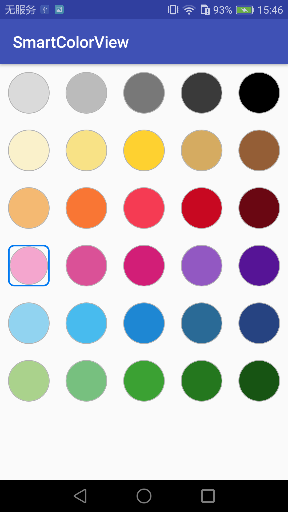
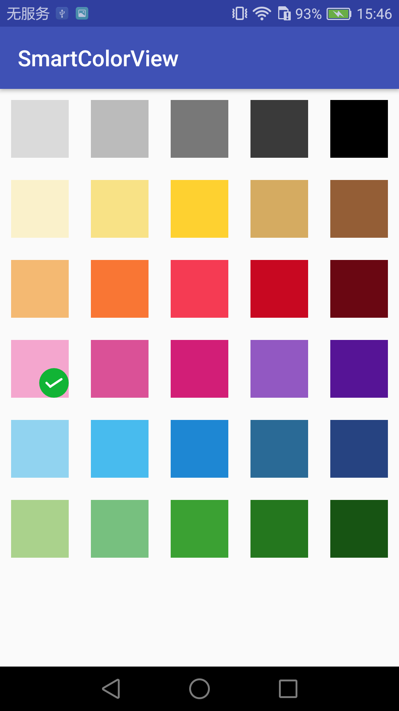
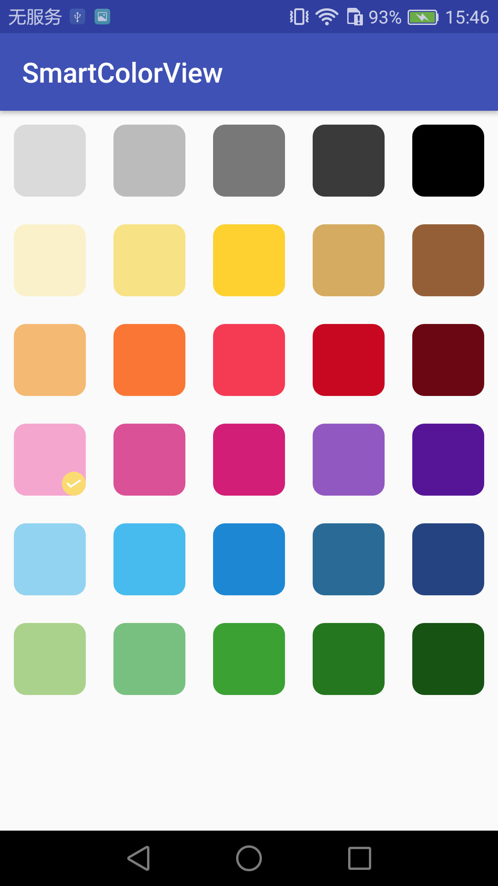

# SmartColorView

[![Apache License 2.0][1]][2]
[![Release Version][30]][31]
[![PRs Welcome][32]][33]
[![API][3]][4]

今天是2017年的第一个工作日，就用这个自定义颜色选择控件来纪念下吧～～

相信做过安卓应用的主题切换、富文本编辑器文字颜色切换、画笔颜色切换等项目，都会遇到关于颜色选择的UI，虽然效果很好实现，比如通过selector的形式就很容易，但是如果项目里面有多处关于颜色选择的UI，只是有一点点差别，
那么我们就得维护多套selector，不能达到复用的效果，因此，我总结几种常见的UI，通过自定义view达到组合及复用的效果。以下列出5中效果图，当然并不局限于这5中效果，通过多种属性的组合，可以实现很多种效果。

# 效果图








demo[下载地址](apk/smartcoloview.apk)

# 使用方法
maven

```xml
<dependency>
  <groupId>com.smart.colorview</groupId>
  <artifactId>colorview</artifactId>
  <version>1.1.1</version>
</dependency>
```
or gradle

```gradle
dependencies {
    compile 'com.smart.colorview:colorview:1.1.1'
}
```

布局代码：

```xml
<com.smart.colorview.normal.CircleColorView
xmlns:circle="http://schemas.android.com/apk/res-auto"
android:layout_width="wrap_content"
android:layout_height="wrap_content"
circle:circleColor="#9258c2"
circle:innerStrokeDividerWidth="6dp"
circle:innerStrokeWidth="0dp"
circle:innerType="inner"
circle:normalUseOutline="true"
circle:outlineStrokeColor="#9258c2"
circle:outlineStrokeWidth="2dp"
circle:selectUseFrame="false"
circle:selectUseOutline="true"/>
```
java代码：
```java
CircleColorModel circleColorModel = new CircleColorModel();
circleColorModel.setCircleColor(0xff9258c2);
circleColorModel.setSelectUseOutline(true);
circleColorModel.setOutlineStrokeWidth(4);
circleColorModel.setOutlineStrokeColor(0xff9258c2);
circleColorModel.setInnerType(CircleColorView.InnerType.INNER);
circleColorModel.setInnerStrokeWidth(0);
circleColorModel.setInnerStrokeDividerWidth(14);
circleColorModel.setCircleSelected(true);
mCircleColorView.setCircleColorModel(circleColorModel);
```
效果：

布局代码：
```xml
<com.smart.colorview.normal.RectangleColorView
xmlns:rectangle='http://schemas.android.com/apk/res-auto'
android:layout_width="wrap_content"
android:layout_height="wrap_content"
rectangle:rectOutlineStrokeWidth="0dp"
rectangle:rectShowTick="true"
rectangle:rectTickBackgroundColor="#fadb71"
rectangle:rectTickDirection="rightBottom"
rectangle:rectTickStrokeColor="#ffffff"
rectangle:rectTickStrokeWidth="2dp"
rectangle:rectTickType="auto"
rectangle:rectangleColor="#9258c2"
rectangle:rectangleCornerRadius="8dp"
rectangle:rectangleSelected="true"/>
```
java代码
```java
RectangleColorModel rectangleColorModel = new RectangleColorModel();
rectangleColorModel.setRectangleColor(0xff9258c2);
rectangleColorModel.setRectangleColorRadius(26);
rectangleColorModel.setRectTickStrokeWidth(4);
rectangleColorModel.setRectTickStrokeColor(0xffffffff);
rectangleColorModel.setRectTickBackgroundColor(0xfffadb71);
rectangleColorModel.setTickDirection(RectangleColorView.TickDirection.RIGHT_BOTTOM);
rectangleColorModel.setRectShowTick(true);
rectangleColorModel.setRectSelected(true);
mRectangleColorView.setRectangleColorModel(rectangleColorModel);
```
效果：


如果在使用过程中遇到什么问题，欢迎[issue](https://github.com/miaolingzi/SmartColorView/issues)告诉我，我将全力为你解决～～

如果喜欢，欢迎star一下，您的star将是我开源路上永久的动力～～

## About Me

 - **QQ：**645318955
 - **简书：**[妙铃子](http://www.jianshu.com/users/03ece7ed904a/latest_articles)
 - **Blog：**[妙铃子](http://blog.csdn.net/miaolingzi)
 - **Email：**fengjianhui1989@163.com

## License
```
Copyright (C) 2017 Jianhui Feng

Licensed under the Apache License, Version 2.0 (the "License");
you may not use this file except in compliance with the License.
You may obtain a copy of the License at

http://www.apache.org/licenses/LICENSE-2.0

Unless required by applicable law or agreed to in writing, software
distributed under the License is distributed on an "AS IS" BASIS,
WITHOUT WARRANTIES OR CONDITIONS OF ANY KIND, either express or implied.
See the License for the specific language governing permissions and
limitations under the License.
```

[1]:https://img.shields.io/:license-apache-blue.svg
[2]:https://www.apache.org/licenses/LICENSE-2.0.html
[3]:https://img.shields.io/badge/API-14%2B-red.svg?style=flat
[4]:https://android-arsenal.com/api?level=14
[30]:https://img.shields.io/badge/release-1.1.1-red.svg
[31]:https://github.com/miaolingzi/SmartColorView/releases
[32]:https://img.shields.io/badge/PRs-welcome-brightgreen.svg
[33]:https://github.com/miaolingzi/SmartColorView/pulls
